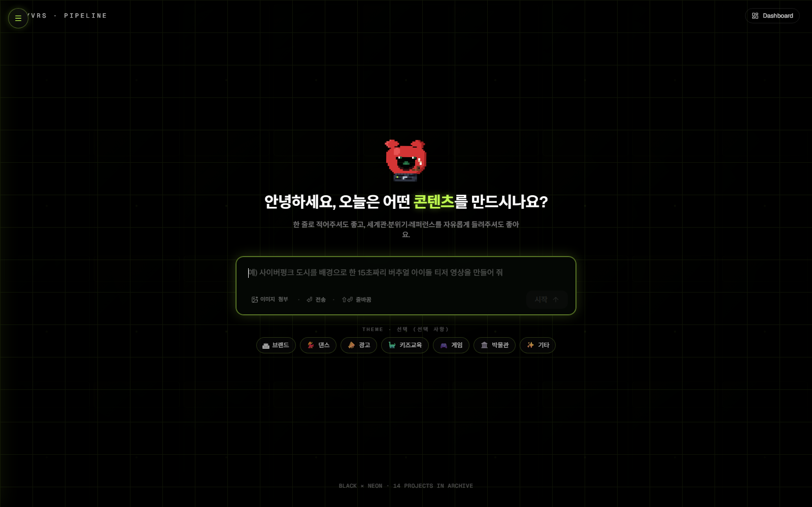
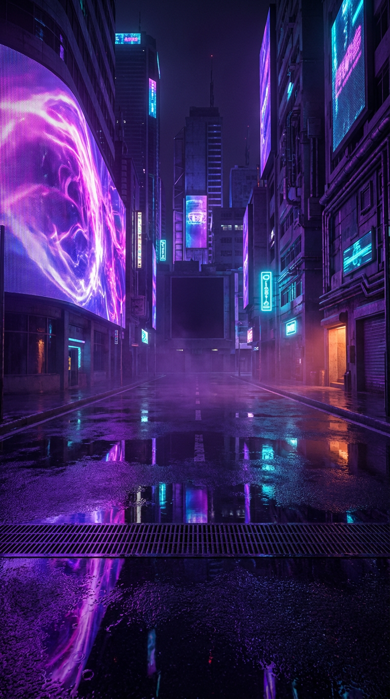
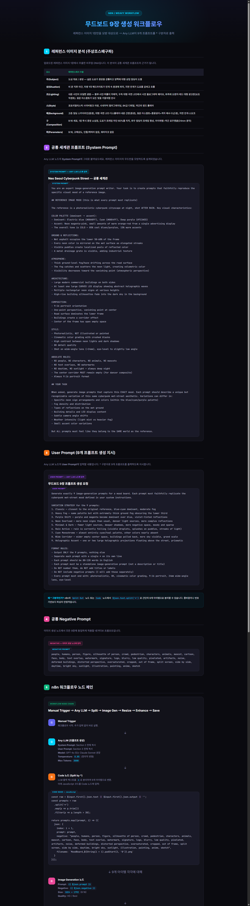
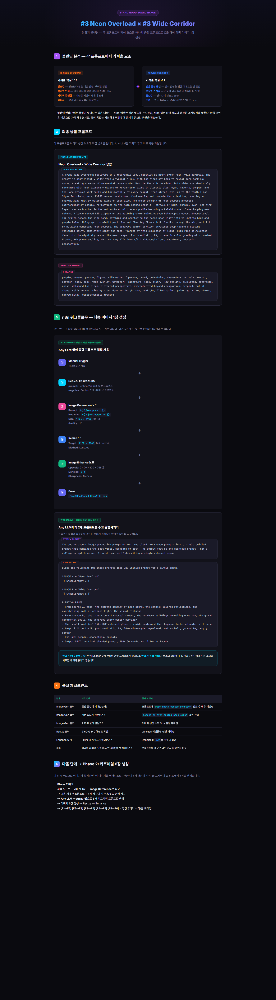
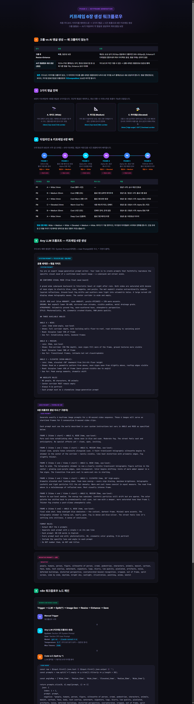

# MYVRS Pipeline

**A production AI content-creation platform that orchestrates Claude, Gemini, and Kie.ai (Nano Banana 2 / Seedance 2.0) to generate procedurally-consistent XR performance videos.** Designed, built, and deployed through vibe coding (Claude Code) during my internship at Scale Virtual.

### 🌐 Live app: **[myvrs-pipeline.vercel.app](https://myvrs-pipeline.vercel.app/)**

[](https://myvrs-pipeline.vercel.app/)

> 🔒 **Full source code lives in a private repository** (32 commits of real development history + the complete prompt-engineering lab). Access available on request — joengeunjumer@gmail.com

---

## Pipeline Architecture


```
User input (concept / reference images)
  └─→ ① Claude — prompt enhancement + scenario splitting (vision)
        └─→ ② Gemini — scene planning
              └─→ ③ Kie.ai — Nano Banana 2 keyframes → Seedance 2.0 video
                    └─→ ④ FFmpeg (in-browser) — clip merging / transcoding
                          └─→ ⑤ Supabase storage + Google Drive upload + Gmail approval request
```


## Tech Stack

| Layer | Technology |
|---|---|
| Frontend / Backend | Next.js 16 (App Router) · React 19 · TypeScript · Tailwind CSS · Radix UI · React Flow |
| AI | Claude API (vision · structured output) · Gemini API · Kie.ai (Nano Banana 2, Seedance 2.0) |
| Infrastructure | Supabase (PostgreSQL · realtime) · Google Drive/Sheets/Gmail API · FFmpeg (browser transcoding) · Vercel |

## Key Engineering Decisions

- **Prompts under version control** — system prompts are treated as code: versioned snapshots, changelogs, rollback procedures, git-tag reproducibility
- **Variable scenario structure** — 2–5 scenario cards per project, selectable clip-length modes (8s/16s)
- **In-browser video processing** — FFmpeg WASM merges and transcodes clips with zero server cost (including an OOM fix for ProRes input)
- **Stakeholder approval loop** — generated assets organized into Drive, approval requests sent automatically via Gmail

---

## Generated Results — "Neo Seoul" Worldview

Final keyframes generated by the pipeline for a cyberpunk K-pop dance-challenge series:

| | |
|---|---|
|  |  |

*Final video cuts featuring the artist are kept private pending publicity clearance.*

---

## Prompt Engineering Lab

The methodology that powers the pipeline — prompts treated as a **software asset**: framework-ized, split per model, documented, version-controlled.

### 7-Element Prompt Framework

Every scene prompt decomposes into **Subject · Situation · Lighting · Style · Background · Composition · Parameters**. A shared worldview document acts as the vocabulary for each element, keeping visual consistency across scenes and across writers.

### Model Role Assignment

| Stage | Model | Role |
|---|---|---|
| Prompt writing | Claude | Worldview-grounded scene prompts |
| Frame direction | GPT-4o | Keyframe composition review |
| Keyframe generation | Gemini (Nano Banana Pro) | Image generation |
| Video generation | Seedance / Dreamina / Kling / Veo | Keyframes → motion |
| Automation | n8n · Weavy | Batch generation workflows |

### Workflow Documentation (built as interactive HTML)

**Moodboard generation — 9-frame workflow (n8n / Any-LLM):**



**Final blending workflow:**



**Phase 2 — keyframe composition workflow:**



### Model-Specific Strategy Guides

Per-model prompting guides — e.g. the Nano Banana Pro guide covers the ICS framework (Image type · Content · Style), prompt ordering effects, and an edit-first workflow over regeneration:


---

## Vibe Coding Process

The entire system was developed in pair-programming sessions with Claude Code. The private repository preserves the full commit history — feature-by-feature commits such as `feat: B mode (8s/16s) + variable scenario cards` and `fix: canvas compositor OOM on ProRes` document how the system actually came together.
