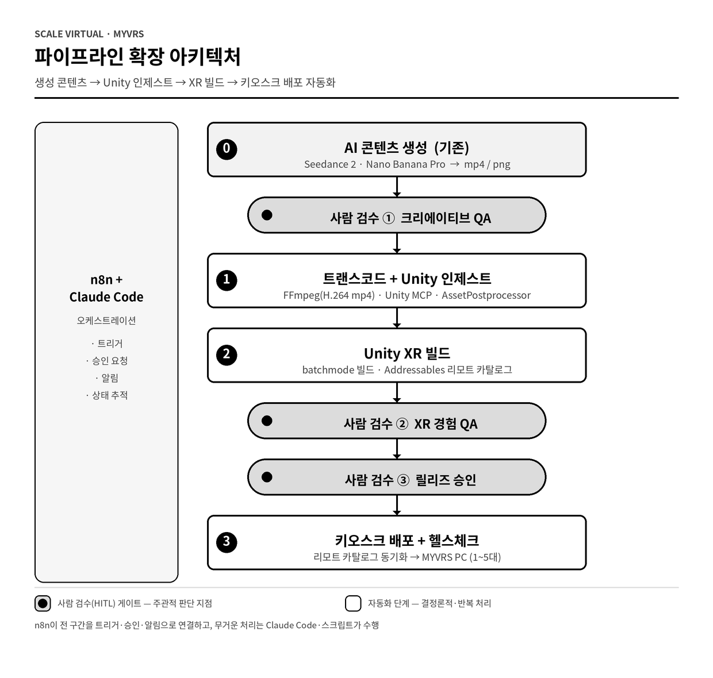
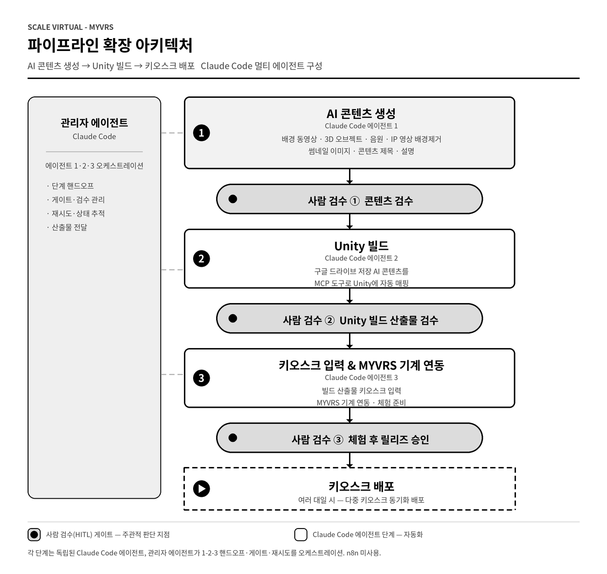

# MYVRS Pipeline

**A production Next.js application that orchestrates Claude, Gemini, and Kie.ai (Nano Banana 2 / Seedance 2.0) to auto-generate procedurally-consistent, multi-frame XR dance performance videos.** Designed, built, and deployed to production (Vercel) through vibe coding (Claude Code) during my internship at Scale Virtual.

> 🔒 **Full source code lives in a private repository** (32 commits of real development history). Access available on request — joengeunjumer@gmail.com

## Pipeline Architecture



```
User input (concept / reference images)
  └─→ ① Claude — prompt enhancement + scenario splitting (vision)
        └─→ ② Gemini — scene planning
              └─→ ③ Kie.ai — Nano Banana 2 keyframes → Seedance 2.0 video
                    └─→ ④ FFmpeg (in-browser) — clip merging / transcoding
                          └─→ ⑤ Supabase storage + Google Drive upload + Gmail approval request
```

### Automation Workflow



## Tech Stack

| Layer | Technology |
|---|---|
| Frontend / Backend | Next.js 16 (App Router) · React 19 · TypeScript · Tailwind CSS · Radix UI · React Flow |
| AI | Claude API (vision · structured output) · Gemini API · Kie.ai (Nano Banana 2, Seedance 2.0) |
| Infrastructure | Supabase (PostgreSQL · realtime) · Google Drive/Sheets/Gmail API · FFmpeg (browser transcoding) · Vercel |

## Key Engineering Decisions

- **Prompts under version control** — system prompts are treated as code: versioned snapshots (base v1.0–v1.1, theme v1.0–v1.1), changelogs, rollback procedures, git-tag reproducibility
- **Variable scenario structure** — 2–5 scenario cards per project, selectable clip-length modes (8s/16s)
- **In-browser video processing** — FFmpeg WASM merges and transcodes clips with zero server cost (including a fix for an OOM crash on ProRes input)
- **Stakeholder approval loop** — generated assets are organized into Drive and approval requests are sent automatically via Gmail

## 🎬 Demo

<!-- Drag & drop a demo video (mp4, <10MB) here while editing this README on GitHub -->
Demo video coming soon

## Vibe Coding Process

The entire system was developed in pair-programming sessions with Claude Code. The private repository preserves the full commit history — feature-by-feature commits such as `feat: B mode (8s/16s) + variable scenario cards` and `fix: canvas compositor OOM on ProRes` document how the system actually came together.
